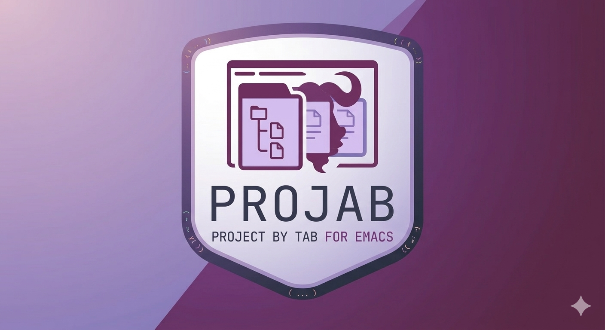

* Projab - Project by tab
Projab manages project from =project.el= with =tab-bar= and =desktop.el= .

This package aims to provide:

- Depends only *standard package* of Emacs. It provides really good maintainability
  - Do not add other-package related function, such as for consult-buffer, or others.
- Do not change the original behavior with advice/hook
  - Allow changing hook or some function advice/hook only via Projab's function. So that users can understand how it works.

** Capability

- Simple integration of tab-bar, project.el, and desktop.el
- It has some convenient features for daily use
  - list buffers on the tab, for consult
  - Out-of-box auto save function
- Add/Remove buffer into/from project unless the file is not in the project

** Will not implement
- Window layout restoration
  - This is the most difficult thing in such a session management. Other packages will try to manage this, but it seems that is only opinionated, each person has different opinions.
- Customization of the desktop directory name
  - The =.emacs.desktop= file is not portable between machines.
  - If you change the project's location, it becamos incompatible and cannot be reused.

* Install
This package does not join ELPA/MELPA. So you can:

- Install via package.el's VC integration (recommendation)
- use straight.el, elpaca.el, or such a similar package
- Download projab.el and put it to your =load-path= .
** Setup

#+begin_src emacs-lisp
  ;; Avoid accidentally rollback layouts.
  (setopt desktop-restore-frames nil)

  (require 'projab)
  ;; Enable global minor mode.
  (projab-mode +1)
#+end_src

* Usage

** Switching between projects
Use =projab-switch-project= or =tab-bar-switch-to-tab= . I recommend using =tab-bar-switch-to-tab= when you use Marginalia.

* Configuration
** Customize

| Variable                      | Type          | Default             | Description                                                                                                                  |
|-------------------------------+---------------+---------------------+------------------------------------------------------------------------------------------------------------------------------|
| =projab-sessions-directory=   | directory     | =~/.emacs.d/projab= | Directory where per-project sessions are stored.                                                                             |
| =projab-auto-restore-session= | boolean       | =t=                 | If non-nil, automatically restore a project's session when opening its tab.                                                  |
| =projab-auto-save-on-exit=    | boolean       | =t=                 | If non-nil, automatically save all project sessions before Emacs exits.                                                      |
| =projab-auto-save-interval=   | number or nil | =nil=               | Interval in minutes for timer-based auto-save.  =nil= disables it.  Call =projab-auto-save-timer-reset= to apply at runtime. |
** Consult integration
=projab= does not provide any integration of =consult=, but it can be done with really simple elisp.

#+begin_src emacs-lisp
  ;; Filter Buffers for Consult-Buffer
  (with-eval-after-load 'consult
    ;; set consult-workspace buffer list
    (defvar consult--source-workspace
      (list
       :name "Workspace Buffers"
       :narrow ?w
       :history 'buffer-name-history
       :category 'buffer
       :state #'consult--buffer-state
       :default t
       :items
       (lambda ()
         (consult--buffer-query
          :predicate #'projab-local-buffer-p
          :sort 'visibility
          :as #'buffer-name)))
      "Set workspace buffer list for consult-buffer.")
    (add-to-list 'consult-buffer-sources 'consult--source-workspace))
#+end_src
** Dashboard integration
This package does not make any hook/advice for project.el or other packages. Consequently, using [[https://github.com/emacs-dashboard/dashboard][emacs-dashboard]] to open projects will cause problems.

My configuration is here:

#+begin_src emacs-lisp
  (defun my/dashboard-insert-projects (list-size)
    "Insert a list of known projects into the dashboard.
  LIST-SIZE limits the number of projects shown."
    (dashboard-insert-section
     "Projects:"
     (seq-map
      (lambda (root)
        (abbreviate-file-name (directory-file-name root)))
      (project-known-project-roots))
     list-size
     'projects
     (dashboard-get-shortcut 'projects)
     `(lambda (&rest _) (projab-open-project ,el))
     (format "%s" el)))

  (add-to-list
   'dashboard-item-generators
   '(projects . my/dashboard-insert-projects))
  (add-to-list 'dashboard-item-shortcuts '(projects . "p"))
  ;; put `project' to dashboard
  (setopt dashboard-items '((projects . 10)))
#+end_src

* Development

- Need =Taskfile= to execute task.

** Standard check
#+begin_src shell
  $ task check
#+end_src

** Test management
Add test cases to =projab-test.el= . Use *ERT* for testing.

* Information

** Similar project
- [[https://github.com/mclear-tools/tabspaces][Tabspaces]]
  - =projab= is heavily inspired by this package. I recommend using this package first.
- [[https://codeberg.org/akib/emacs-workroom][emacs-workroom]]
  - Similar concept, but without tab-bar integration
- [[https://github.com/nex3/perspective-el][perspective-el]]
  - A very popular package to manage perspective
